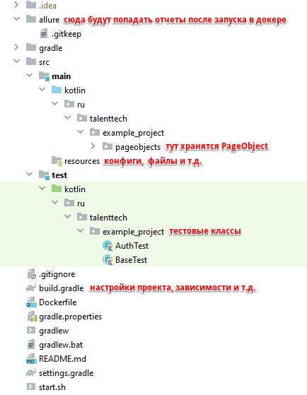

Проект по тестированию UI
---
## Структура проекта

## Создание и подготовка собственного проекта на основании этого шаблона
1. Создать репозиторий в GitHub, на основании этого шаблона. Для этого, при создании, в разделе **Repository template** выбрать `ui_autotests_template`
2. Клонировать созданный проект себе и открыть его в Intellij IDEA
3. Переименовать папку `product_name`, в директории `src/main/kotlin/ru/talenttech`, на название тестируемого продукта
4. В файле `settings.gradle` указать название своего проекта, например так же, как назвали репозиторий в GitHub  
6. При необходимости удалить тестовые примеры/классы
7. Импортировать gradle проект: в правом нижнем углу, в окне `Gradle build script found`, нажать на `Import`. Если такое окно не отображается, то открыть контекстное меню (правая кнопка мыши) файла `build.gradle` и нажать `Import Gradle project`

## Запуск тестов
### Локально
#### В Intellij IDEA:
В правой части интерфейса, открыть вкладку `Gradle`, найти и запустить таску: Tasks -> verification -> **test**   
Или в файле `build.gradle` и запустить таску `test`

#### В терминале:
Открыть терминал в директории проекта _(В Intellij IDEA он автоматически открывается в этой директории)_ и выполнить команду:
- Для Windows: `gradlew test --info`
- Для MacOS / Linux: `./gradlew test --info`

Чтобы запустить только тесты аннотированные тегами, например `@Tag("smoke")` или `@Tag("sanity_check")`, к команде запуска добавить `-DincludeTags=smoke,sanity_check` (принимается как один, так и несколько тегов через запятую, без пробела)

### В Docker
Открыть терминал в директории проекта (В Intellij IDEA он автоматически открывается в этой директории), заменить в двух местах `your_image` на свое название и выполнить команду:
- Для Windows: `docker build -t your_image . && docker run --mount type=bind,source=%cd%/allure,target=/allure your_image:latest`
- Для MacOS: `docker build -t your_image . && docker run --mount type=bind,source=$(pwd)/allure,target=/allure your_image:latest`

Чтобы запустить только тесты аннотированные тегами, например `@Tag("smoke")` или `@Tag("sanity_check")`, к команде запуска добавить ` smoke,sanity_check` (принимается как один, так и несколько тегов через запятую, без пробела между ними)

## Allure отчет
### Генерация отчета, после прогона тестов
#### В Intellij IDEA:
B Intellij IDEA, в правой части, открыть вкладку Gradle, найти и запустить таски:
- Tasks -> other -> **allureReport** (отчет сгенерируется в директорию `build/reports/allure-report`)
#### В терминале:
Открыть терминал в директории проекта _(В Intellij IDEA он автоматически открывается в этой директории)_ и выполнить команду:
- Для Windows: `gradlew allureReport`
- Для MacOS / Linux: `./gradlew allureReport`
#### После запуска в Docker:
После прохождения отчета в докере, в корне проекта будет автоматически создана директория `allure`. Перенести ее содержимое в директорию `build/allure-results` и выполнить действия их предыдущих пунктов 

### Открытие отчета
1. B Intellij IDEA перейти в директорию со сгенерированным отчетом `build/reports/allure-report`
2. Открыть файл `index.html`
3. В файле, в правом верхнем углу отображается панель с браузерами - выбрать нужный браузер для открытия
   1. Если панель не отображается, то открыть контекстное меню файла (правая кнопка мыши) и выбрать: **Open In** -> **Browser** -> **<Нужный браузер>**

## Интерграция с TestRail
Для настройки интеграции с TestRail нужно, в файле `src/main/resources/testrail.properties`, указать данные в соответствии с [инструкцией](https://github.com/severgroup-tt/xqa_testrail)

Для ручной публикации результатов добавлена таска `testRailPublish`